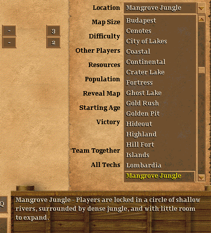
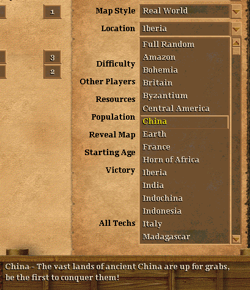

# aoc-builtin-rms

A little mod for adding new "builtin"-like RMS scripts to Age of Empires 2: The Conquerors, with UserPatch.

This mod works together with UserPatch 1.5 and the [aoc-mmmod][] loader.

|||
|-|-|
|  |  |

## Usage

Install the [aoc-mmmod][] loader in your mod's `Data\` folder. Grab `aoc-builtin-rms.dll` from the [releases](https://github.com/SiegeEngineers/aoc-builtin-rms/releases) page, and place it in your mod's `mmmods\` folder.

```bash
Games\Your Mod Name\Data\language_x1_p1.dll # the mmmod loader
Games\Your Mod Name\Data\language_x1_m.dll # optionally, language file with custom strings
                                           # (with aoc-language-ini, this is not needed)
Games\Your Mod Name\mmmods\aoc-builtin-rms.dll # the builtin RMS module!
```

Put your mod's random maps in a .drs archive as `bina` files. The IDs don't really matter so long as they don't clash. Using the 54240 ~ 54299 range is pretty safe. Note that random maps in `.drs` files do **not** automatically load `random_map.def`. Include this at the top of your scripts:

```
#include_drs random_map.def 54000
```

This dll looks for an `aoc-builtin-rms.xml` configuration file in your mod's base directory (`Games\YourModName`). For example, for WololoKingdoms, the file should be in `Games\WololoKingdoms\aoc-builtin-rms.xml`.

The file hould contain a `<random-maps>` top-level element, and sections for different map styles. There is a `<standard>` section for the Standard map style, a `<real-world>` section for Real World maps, and a `<section>` element that defines a custom section. Sections contain `<map />` elements for each random map.

```xml
<?xml version="1.0" encoding="utf-8"?>
<random-maps>
  <standard>
    <map id="-1" name="cenotes" string="10916" drsId="54250" />
  </standard>
  <real-world>
    <map id="-2" name="india" string="10940" drsId="60250" scxDrsId="61250" />
  </real-world>
</random-maps>
```

Each map must have an `id`, a `name`, `string`, and a `drsId`.

The `id` will be used internally by the game to refer to the map. It should never change. Some IDs (0-50 more or less) are already in use by the game for the standard builtin maps. I recommend using small negative numbers to reduce the risk of clashes. Only 256 IDs are available in total, so you can use roughly the range from -1 to -200 for custom random maps.

The `name` determines what the RMS and AI constants for this map are named. For example, `name="cenotes"` allows using the `(map-type cenotes)` fact and doing `#load-if-defined CENOTES-MAP` in AIs. Do **not** use spaces here, instead separate words with dashes, eg `name="city-of-lakes"`.

The `string` is the string ID containing the localised map name, as shown in the random map selection dropdown menu. This string must be present in a `language_x1_m.dll` file with your mod. You can also use the [aoc-language-ini][] module so you can put map names in a simple text file instead.

The `drsId` is the `bina` resource ID that contains the map script.

Optionally, `scxDrsId` can refer to a `bina` resource ID containing a scenario file for Real World maps.

Optionally, `description` can refer to a string ID that will be shown when hovering the map name in the game setup screen. This string must be present in a `language_x1_m.dll` file with your mod. You can also use the [aoc-language-ini][] module so you can put map names in a simple text file instead.
```xml
<map id="-10" name="valley" drsId="54260" string="10923" description="30155" />
```

Optionally, `terrainOverrides` can be used to override terrain SLPs, similarly to how ZR@ maps allow you to do for custom random maps in UserPatch 1.5. `terrainOverrides` is a comma-separated strings of SLP id replacements:
```xml
<map terrainOverrides="15018=15033,15014=15012" />
```
The left-hand side is the original SLP ID, where the right-hand side is the new SLP ID. In this case, the road SLP (15018) is replaced with a custom SLP 15033, and the shallows SLP (15014) is replaced with a custom SLP 15012. This is similar to placing the graphic for the 15033 slp in your ZR@ map as `15018.slp`.
These replacement SLPs must be present in the `slp ` resource table of a DRS file with your mod.

## Custom Sections

`<standard>` and `<real-world>` add the maps you specify to the random map dropdowns when either of these map styles is selected.

For `<real-world>` maps, each map's name is prefixed with `real-world-` in AI constants, and with `REAL-WORLD-` in AI symbols for #load-if-defined. This mirrors the naming of the constants and symbols for the default maps.

You might want to add more map styles, like HD Edition's "Special" maps. To do this, use the `<section>` element.

```xml
<?xml version="1.0" encoding="utf-8"?>
<random-maps>
  <section name="4801" aiSymbolPrefix="SPECIAL-MAP" aiConstPrefix="special-map">
    <map id="-33" name="special-test" drsId="54207" string="4841" description="4842" />
    <map id="-34" name="special-two" drsId="54209" string="4843" description="4844" />
    <map id="-35" name="special-three" drsId="54226" string="4845" description="4846" />
    <map id="-36" name="special-four" drsId="54225" string="4847" description="4848" />
  </section>
</random-maps>
```

In this case, I used some random names that already exist:


`section.name` is the string ID containing the map style name that will be shown in the Map Style dropdown. This string must be present in a `language_x1_m.dll` file with your mod. You can also use the [aoc-language-ini][] module so you can put map names in a simple text file instead.

`section.aiSymbolPrefix` is an uppercase string that will be prepended to AI symbols for #load-if-defined. A dash is added automatically, so with a symbol prefix "SPECIAL-MAP" and a map named "canyons", the resulting AI symbol will be "SPECIAL-MAP-CANYONS".

`section.aiConstPrefix` is a lowercase string that will be prepended to AI constants. A dash is added automatically, so with a constant prefix "special-map" and a map named "canyons", the resulting AI constant will be "special-map-canyons".

## Build

This project can only be built with MinGW GCC compilers at this time.

To create a debug build (with some logging):

```
make
```

To create a release build (smaller and no logging):

```
make clean
env RELEASE=1 make
```

## License

[LGPL-3.0](./LICENSE.md)

[aoc-mmmod]: https://github.com/SiegeEngineers/aoc-mmmod
[aoc-language-ini]: https://github.com/SiegeEngineers/aoc-language-ini
